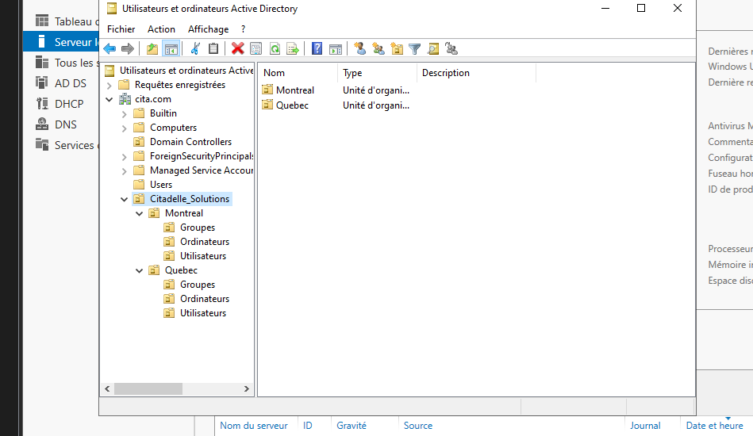
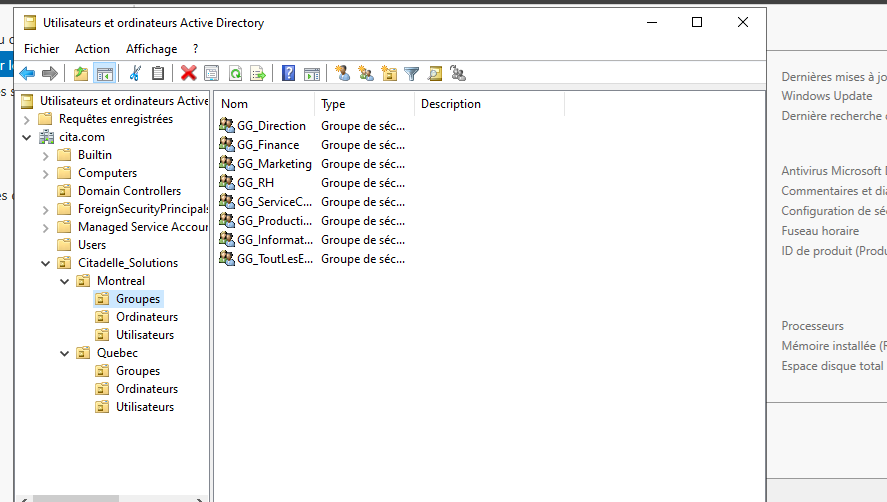
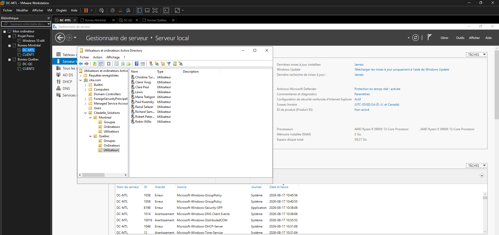
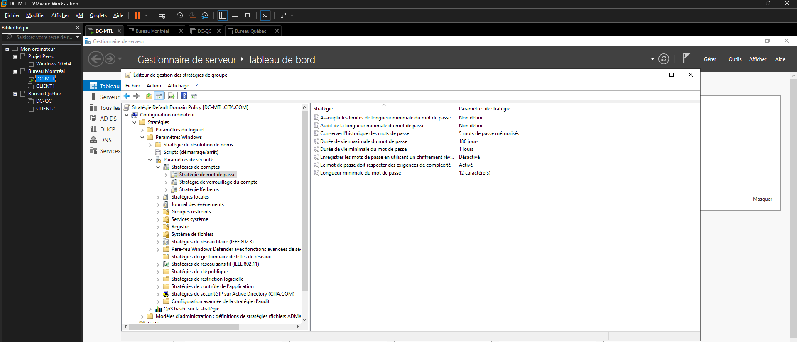
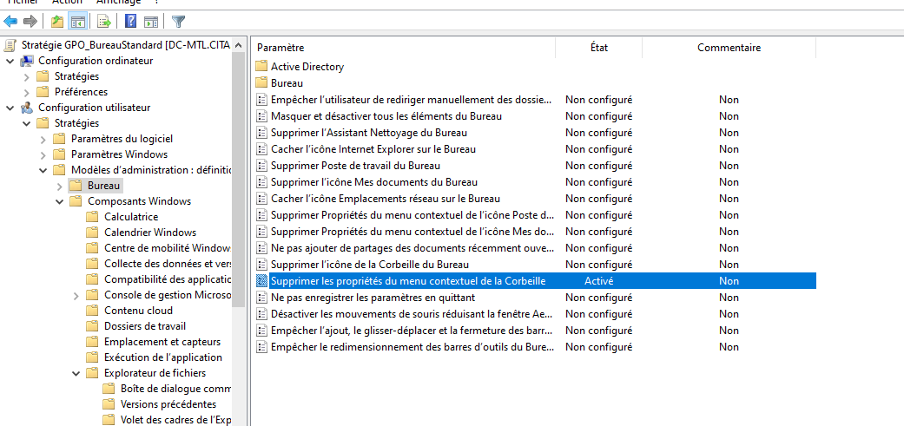

# Documentation Infrastructure & Active Directory — Citadelle Solutions

Ce document présente la configuration de l'infrastructure réseau Active Directory pour le domaine `cita.com` de l'entreprise **Citadelle Solutions**.

---

## 1. Structure de l'Annuaire Active Directory (AD DS)

L'architecture AD a été conçue pour séparer les ressources selon les deux sites géographiques de l'entreprise : **Montreal** et **Quebec**.

*Figure 1 : Arborescence de l'OU principale Citadelle_Solutions et sous-OU régionales.*

* **OU Principale :** `Citadelle_Solutions`
* **Sous-OU Régionales :** `Montreal` et `Quebec`
* **Dossiers d'objets :** Chaque site dispose de ses propres conteneurs dédiés (`Groupes`, `Ordinateurs`, `Utilisateurs`).

---

## 2. Gestion des Groupes de Sécurité Globaux

Pour appliquer le modèle AGDLP et gérer les accès aux dossiers partagés, l'ensemble des groupes globaux a été structuré par département.

*Figure 2 : Liste des groupes de sécurité globaux créés dans l'OU Montreal > Groupes.*

* **Groupes Départementaux (`GG_*`) :** `GG_Direction`, `GG_Finance`, `GG_Marketing`, `GG_RH`, `GG_ServiceClients`, `GG_Production`, `GG_Informatique`.
* **Groupe Global Entreprise :** `GG_TousLesEmployes` (regroupant le personnel des deux sites).

---

## 3. Comptes Utilisateurs & Population des OU

Les utilisateurs ont été créés et assignés dans leurs Unités Organisationnelles respectives pour garantir une gestion étanche des droits.

*Figure 3 : Liste des comptes utilisateurs configurés dans l'OU Quebec > Utilisateurs.*

*Figure 4 : Vue du dossier Groupes pour le site de Québec.*

---

## 4. Stratégie de Sécurité des Comptes & Mots de Passe (GPO)

Le durcissement de la sécurité des accès est appliqué à l'ensemble du domaine via l'Éditeur de gestion des stratégies de groupe (*Default Domain Policy*).

*Figure 5 : Paramètres de sécurité des mots de passe de domaine.*

| Paramètre de Sécurité | Configuration Appliquée |
| :--- | :--- |
| **Longueur minimale du mot de passe** | **12 caractères** |
| **Exigences de complexité** | **Activé** |
| **Historique des mots de passe** | **5 mots de passe mémorisés** |
| **Durée de vie maximale du mot de passe** | **180 jours** |
| **Durée de vie minimale du mot de passe** | **1 jour** |

---

## 5. Restrictions Utilisateurs & Hardening Poste Client

Afin de verrouiller l'environnement de travail des postes clients standards, une stratégie dédiée `GPO_BureauStandard` a été mise en place.

*Figure 6 : Activation de la restriction sur le menu contextuel de la Corbeille.*

* **Verrouillage du Bureau :** Désactivation de l'accès aux propriétés contextuelles de la Corbeille (`Supprimer les propriétés du menu contextuel de la Corbeille : Activé`).
* **Sécurisation système :** Blocage de l'accès aux outils système avancés (Invite de commandes, Registre, PowerShell) pour les utilisateurs non-administrateurs.
